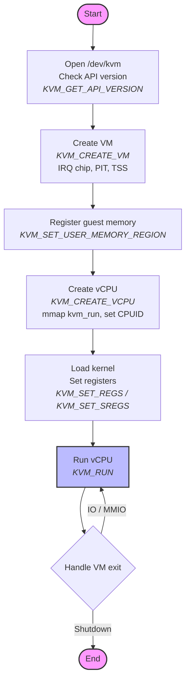
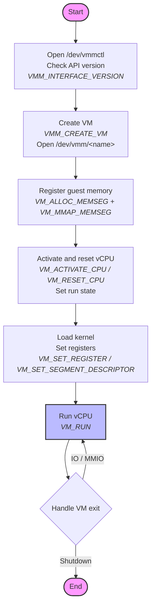

# Mapping KVM to bhyve

[ferrvm](https://github.com/anpapagian/ferrvm) is a toy Virtual Machine Manager (VMM) written in Rust. At first it worked only with KVM on Linux. Now it supports both KVM on Linux and bhyve on illumos. This article shows how these two APIs compare, and how ferrvm supports both backends with very little duplicated code.

## KVM in Linux

KVM uses an ioctl-based API in order to:

1. Initialize KVM.
2. Create and manage VMs.
3. Register memory.
4. Create and manage vCPUs.
5. Device configuration.
6. IRQ configuration.
7. etc.

The full KVM API can be found in https://docs.kernel.org/virt/kvm/api.html.

The following workflow shows the main steps that ferrvm uses with KVM:



## bhyve in illumos

bhyve uses a conceptually similar API for the same work.

The following workflow shows the main steps that ferrvm uses with bhyve. Notice that it has the same shape as the KVM workflow above. Only the names of the calls and a few small details change:



## ferrvm traits

The two workflows above have the same shape. Both APIs do the same steps in the same order: open a device, create a VM, give it memory, create a vCPU, load the kernel, run, and handle exits. Only the names of the calls and a few small details are different.

Because of this, we can describe what a hypervisor must do with a small set of [traits](https://doc.rust-lang.org/book/ch10-02-traits.html). A trait says *what* operations exist, but not *how* they work. Each backend then fills in the *how*.

We use three traits: `Hypervisor`, `Vm`, and `Vcpu`. A simplified version looks like this:

```rust
pub trait Hypervisor {
    // Create a new VM.
    fn create_vm(&self, name: &str) -> Result<Box<dyn Vm>>;
}

pub trait Vm {
    // Prepare the VM (for example, the interrupt controller and timers).
    fn setup(&self) -> Result<()>;
    // Create a virtual CPU.
    fn create_vcpu(&self, id: u32) -> Result<Box<dyn Vcpu>>;
    // Give a region of host memory to the guest.
    fn register_memory_region(&self, gpa: u64, size: u64, hpa: u64) -> Result<()>;
    // Connect a device to an interrupt line. Returns a sink the device
    // uses to assert that line.
    fn register_irq(&self, irq: u32) -> Result<Arc<dyn IrqSink>>;
}

pub trait Vcpu {
    // Prepare the vCPU before the first run.
    fn setup(&self) -> Result<()>;
    // Run the vCPU until the next VM exit, then handle that exit.
    // Returns `true` if the VM should keep running.
    fn step_run(&mut self, /* ... */) -> Result<bool>;
    // Read and write the CPU registers.
    fn set_regs(&self, regs: &VcpuRegs) -> Result<()>;
    fn get_regs(&self) -> Result<VcpuRegs>;
    fn set_sregs(&self, sregs: &VcpuSregs) -> Result<()>;
    fn get_sregs(&self) -> Result<VcpuSregs>;
}
```

The real traits in [`src/traits.rs`](../src/traits.rs) have a few more details (lifetimes and exact return types for cleanup). We removed them here to make the idea clear.

### Why this design works

This design is a good fit for three reasons:

1. **The two APIs already match.** As we saw, KVM and bhyve do the same steps. So a small trait can cover both without strange compromises. We are not forcing two different things into one shape; they are already close.

2. **The traits hold only what the VMM needs.** The rest of ferrvm (the kernel boot code, the serial port, the device bus, the run loop) only needs to create a VM, give it memory, run a vCPU, and read or write registers. That is exactly what the traits offer. Nothing more.

3. **The backend stays out of the way.** The main program only talks to the traits. It never knows if it runs on KVM or on bhyve. All the KVM details live under [`src/kvm/`](../src/kvm/), and all the bhyve details live under [`src/bhyve/`](../src/bhyve/). Each backend is small: it only turns trait calls into `ioctl` calls and converts a few structs.

## What is shared and what is per-backend

Most of ferrvm is shared code that does not change between backends:

- Loading the Linux kernel and setting up the boot parameters.
- The 16550A serial port (UART).
- The PIO and MMIO device bus.
- Guest memory.
- The vCPU run loop and the exit statistics.

Only a small part is per-backend. This is the table of the main calls that each backend has to provide:

| Step | KVM (Linux) | bhyve (illumos) |
|------|-------------|-----------------|
| Open device | `/dev/kvm` | `/dev/vmmctl`, then `/dev/vmm/<name>` |
| Check version | `KVM_GET_API_VERSION` | `VMM_INTERFACE_VERSION` |
| Create VM | `KVM_CREATE_VM` | `VMM_CREATE_VM` |
| Register memory | `KVM_SET_USER_MEMORY_REGION` | `VM_ALLOC_MEMSEG` + `VM_MMAP_MEMSEG` + `mmap` |
| Create vCPU | `KVM_CREATE_VCPU` | `VM_ACTIVATE_CPU` + `VM_RESET_CPU` |
| Prepare vCPU | `KVM_SET_CPUID2` | `VM_SET_RUN_STATE` |
| Set registers | `KVM_SET_REGS` / `KVM_SET_SREGS` | `VM_SET_REGISTER` / `VM_SET_SEGMENT_DESCRIPTOR` |
| Run vCPU | `KVM_RUN` | `VM_RUN` |
| Assert interrupt | `KVM_IRQ_LINE` | `VM_ISA_ASSERT_IRQ` / `VM_ISA_DEASSERT_IRQ` |

## The interesting differences

Most steps map one to one. A few are more interesting, and they explain the exact shape of the traits.

### Reading and writing registers

Both backends need the guest CPU registers (`rax`, `rbx`, `rip`, and so on). We define one backend-neutral struct, `VcpuRegs`, and the matching `VcpuSregs` for the special registers. Each backend converts between this struct and its own format.

For KVM this is one `ioctl` that fills a single `kvm_regs` struct. For bhyve there is no "all registers at once" call. We read or write each register one by one with `VM_GET_REGISTER` and `VM_SET_REGISTER`:

```rust
// bhyve: set every register with its own ioctl.
fn set_regs(&self, regs: &VcpuRegs) -> Result<()> {
    self.set_register(VmRegName::Rax, regs.rax)?;
    self.set_register(VmRegName::Rbx, regs.rbx)?;
    // ... one call per register ...
    self.set_register(VmRegName::Rip, regs.rip)?;
    Ok(())
}
```

The trait hides this difference. The rest of the code just calls `get_regs()` and `set_regs()`.

### The VM exit loop

This is the most interesting difference, and the reason `step_run` is part of the trait.

When the guest does I/O (for example, it writes to the serial port), the CPU stops and gives control back to the VMM. This is a *VM exit*. The VMM handles the I/O and then runs the vCPU again.

The two backends pass this data in different ways:

- **KVM** uses one shared page, `kvm_run`, that we `mmap` once. On an I/O exit, we read the port and the data from this page, do the work, and write the result back into the *same* page. To continue, we just call `KVM_RUN` again.

- **bhyve** uses two separate structs: we pass a `VmEntry` and bhyve fills a `VmExit`. To answer an I/O exit, we must build the *next* entry with a special "fulfill" command and put the result inside it. So the vCPU has to remember what to send on the next run.

You can see this in the bhyve exit handler:

```rust
// bhyve: the result of an I/O exit must be passed back on the next entry.
VmExitCode::Inout => {
    let mut inout = unsafe { vm_exit.u.inout };
    handle_io_exit(&mut inout, stats, pio_bus);

    next_cmd = VEC_FULFILL_INOUT; // tell bhyve we are answering the exit
    next_u.inout = inout;         // carry the result back
    (true, next_cmd, next_u)
}
```

This is why the trait has `step_run` instead of a plain `run`, and why it takes `&mut self`: the bhyve vCPU stores `next_cmd` and the next entry data between runs. The shared run loop does not care about any of this. It just calls `step_run` again and again:

```rust
loop {
    if shutdown.requested() {
        break;
    }
    // Run the vCPU until the next VM exit.
    let should_continue = vcpu.step_run(&mut stats, memory, pio_bus, mmio_bus)?;
    if !should_continue {
        break;
    }
}
```

### Interrupts

A device, like the serial port, needs to send an interrupt to the guest. Both backends do this the same way: one `ioctl` per level change.

- **KVM** asserts or deasserts the line with `KVM_IRQ_LINE`, passing the GSI and a level of `1` or `0`.

- **bhyve** asserts or deasserts the line with `VM_ISA_ASSERT_IRQ` or `VM_ISA_DEASSERT_IRQ`.

Both are hidden behind a small `IrqSink` trait that has only one method, `set_level(asserted)`. A device only sees `IrqSink`, so it does not know which backend is behind it.

## Choosing the backend at build time

We do not choose the backend at run time. We choose it at build time with `#[cfg(target_os = ...)]`. On Linux we build KVM, and on illumos we build bhyve:

```rust
#[cfg(target_os = "linux")]
pub use hypervisor_backend::Kvm as NativeHypervisor;

#[cfg(target_os = "illumos")]
pub use hypervisor_backend::Bhyve as NativeHypervisor;
```

The rest of the code always uses `NativeHypervisor`, so it never changes. The unused backend is not even compiled.

## Conclusion

KVM and bhyve look different when you read their manuals, but they do the same steps in the same order. Because of this, a small set of traits is enough to describe both. The hard, shared work (kernel boot, devices, memory, the run loop) is written once. Each backend stays small and only translates the trait calls into its own `ioctl` calls. Adding a third backend later would mean implementing the same three traits one more time.
