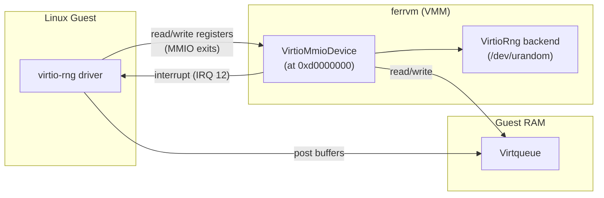
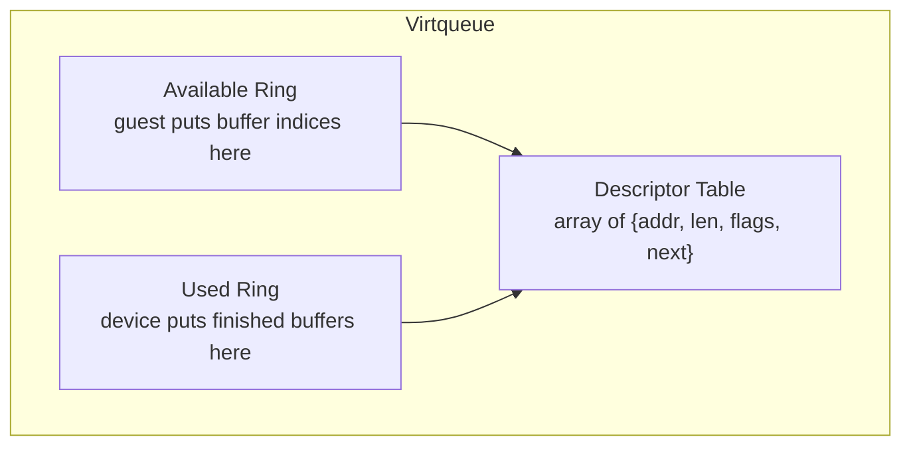
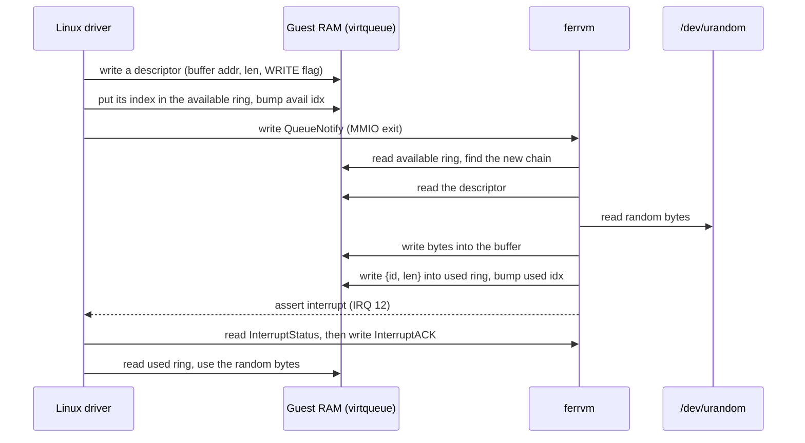

# virtio-rng: The simplest virtio device

[ferrvm](https://github.com/anpapagian/ferrvm/) has now support for a *virtio* device. The first one we added is **virtio-rng**, a source of random bytes. This document explains what virtio is, why we started with rng, and the full protocol: what the guest reads and writes, and how the VMM answers.

## What is virtio?

A virtual machine needs devices: a disk, a network card, a console, a source of randomness, and so on. The VMM has to pretend these devices exist.

There are two ways to do this:

1. **Emulate real hardware.** Copy a real chip (for example, the 16550A UART that ferrvm uses for the serial port). The good part is that the guest already has a driver for it. The bad part is that real chips have many small registers and odd rules. And every access is slow, because each one causes a VM exit.

2. **Use virtio.** virtio is a standard built for virtual machines. It does not copy any real chip. Instead it defines a simple, shared way for a guest and a VMM to pass buffers of data back and forth.

virtio splits the world into two sides:

- The **driver**: the code inside the guest (Linux).
- The **device**: the code inside the VMM (ferrvm).

The register names below use this naming (for example, `DeviceFeatures` are the features *ferrvm* offers, and `DriverFeatures` are the features the *guest* accepts).

## Why virtio-rng?

virtio-rng (the "entropy source", device ID 4) is the simplest virtio device:

- It has **one** virtqueue.
- Data flows in **one** direction only: the device writes random bytes into buffers that the guest gives it.
- It has **no** device-specific configuration to manage.

So it is the perfect device to get the virtio machinery right before adding harder devices like block or network. Once rng works, the hard parts (the transport and the virtqueue) are done, and they are shared by every other virtio device.

In Linux the guest exposes it as `/dev/hwrng`. We can test it like this:

```console
$ cat /sys/class/misc/hw_random/rng_current
virtio_rng.0
$ head -c 32 /dev/hwrng | xxd
[32 random bytes]
```

Without virtio-rng, the first command will return `none` and the second an I/O error.

## The boot argument

We start from the following Linux boot argument that ferrvm passes to the guest:

```console
virtio_mmio.device=512@0xd0000000:12
```

Why do we need this? Real virtio devices are usually found on a PCI bus, and the guest discovers them by scanning that bus. But in ferrvm, in order to keep things simple, we don't have a PCI bus yet. There is also no device tree or ACPI tables to describe the hardware. So the guest has no way to find the device on its own.

The boot argument tells Linux directly where the device is. The format is:

```console
virtio_mmio.device=<size>@<base>:<irq>
```

So our value means:

| Part | Value | Meaning |
|------|-------|---------|
| `size` | `512` | The device has a 512-byte register window. |
| `base` | `0xd0000000` | The window starts at this guest physical address. |
| `irq` | `12` | The device sends interrupts on IRQ line 12. |

This matches exactly what ferrvm sets up in `main.rs`:

```rust
let virtio_rng_gsi = 12;
// ...
mmio_bus.register(0xd000_0000, 512, virtio_rng_device)?;
```

When Linux boots, it reads this argument, creates a virtio-mmio device at `0xd0000000`, and starts talking to it. From here on, the guest and the VMM follow the virtio protocol.

## A high-level view

Here are the pieces and how they connect:



There are three channels between the two sides:

1. **VirtioMmioDevice** at `0xd0000000`. The guest reads and writes these registers to set the device up. Each access leaves the guest and reaches the ferrvm via an MMIO exit.
2. **Virtqueue** in guest RAM. This is a shared ring buffer. The guest puts buffers there; ferrvm reads them, fills them, and marks them done. No exit is needed to access that memory as this is shared.
3. **The interrupt** (IRQ 12). ferrvm uses it to inform the guest that the work is done from it's side.

## The guest path

The **VirtioMmioDevice** is not normal RAM. The address `0xd0000000` is not backed by real memory. So when the guest reads or writes there, the CPU cannot complete the access and stops with a **VM exit** and more specifically an MMIO exit.

The VMM's exit handler takes the address and the data and sends them to the MMIO bus. The bus finds the device that owns the range `[0xd0000000, 0xd0000000 + 512)` and calls it with an **offset** inside that window:

```rust
// On an MMIO exit, the address is turned into an (offset, data) call.
let offset = addr - range.base; // e.g. 0xd0000004 -> offset 0x04
dev.read(offset, data);         // or dev.write(offset, data)
```

So from the device's point of view, it only sees offsets. These offsets refer to the virtio-mmio registers.

## The virtio-mmio registers

This is where everything starts. The guest access the whole device through a fixed set of registers. ferrvm implements virtio-mmio **version 2** (the modern layout) in `src/virtio/mmio.rs`.

| Offset | Name | Dir | What it does | What ferrvm returns / does |
|--------|------|-----|--------------|----------------------------|
| `0x00` | MagicValue | R | Identifies a virtio device | `"virt"` = `0x74726976` |
| `0x04` | Version | R | Transport version | `2` |
| `0x08` | DeviceID | R | Which device this is | `4` (entropy source) |
| `0x0c` | VendorID | R | Vendor | `0x554d4551` (`"QEMU"`) |
| `0x10` | DeviceFeatures | R | Features the device offers | one 32-bit half of our features |
| `0x14` | DeviceFeaturesSel | W | Pick which half to read above | stores the selector |
| `0x20` | DriverFeatures | W | Features the guest accepts | stored |
| `0x24` | DriverFeaturesSel | W | Pick which half to write | stored |
| `0x30` | QueueSel | W | Select the queue to configure | stored |
| `0x34` | QueueNumMax | R | Largest queue size allowed | `256` |
| `0x38` | QueueNum | W | Queue size the guest chose | stored in the queue |
| `0x44` | QueueReady | R/W | Mark the queue ready to use | sets `queue.ready` |
| `0x50` | QueueNotify | W | "I added work to this queue" | runs the device (see below) |
| `0x60` | InterruptStatus | R | Why the interrupt fired | bit 0 = used ring updated |
| `0x64` | InterruptACK | W | Guest clears the interrupt | clears the status bit |
| `0x70` | Status | R/W | Device state machine | stored; writing `0` resets |
| `0x80`/`0x84` | QueueDescLow/High | W | Address of the descriptor table | stored in the queue |
| `0x90`/`0x94` | QueueDriverLow/High | W | Address of the available ring | stored in the queue |
| `0xa0`/`0xa4` | QueueDeviceLow/High | W | Address of the used ring | stored in the queue |
| `0x100`+ | Config space | R/W | Device-specific config | rng has none |

The addresses at `0x80`–`0xa4` are 64 bits, so the guest writes them in two halves (low then high). ferrvm joins the two halves into one `u64`:

```rust
0x80 => { // QueueDescLow: set the low 32 bits
    q.desc_table = (q.desc_table & 0xFFFF_FFFF_0000_0000) | u64::from(val);
}
0x84 => { // QueueDescHigh: set the high 32 bits
    q.desc_table = (q.desc_table & 0x0000_0000_FFFF_FFFF) | (u64::from(val) << 32);
}
```

## Step 1: the handshake

Before any data moves, the guest and the device do a fixed start-up handshake. The virtio spec defines the order. The guest:

1. Reads **MagicValue**, **Version**, and **DeviceID** to check that a real virtio v2 entropy device is there.
2. Writes the **Status** register step by step to walk a state machine. The bits are:
   - `ACKNOWLEDGE` (1): "I see the device."
   - `DRIVER` (2): "I have a driver for it."
   - `FEATURES_OK` (8): "I am happy with the features."
   - `DRIVER_OK` (4): "I am ready to drive it."
3. Negotiates **features**. The device offers a 64-bit set of feature bits through `DeviceFeatures`; the guest writes back the ones it accepts through `DriverFeatures`.
4. Sets up the virtqueue (next section) and marks it ready.

For rng the feature step is simple. ferrvm offers exactly one bit, `VIRTIO_F_VERSION_1` (bit 32), which just says "I am a modern 1.0 device":

```rust
fn device_features(&self) -> u64 {
    super::VIRTIO_F_VERSION_1 // 1 << 32
}
```

Because this bit is number 32, it lives in the high half of the 64-bit set. That is why `DeviceFeaturesSel` exists: the guest selects half 0 to read bits 0–31, and half 1 to read bits 32–63.

ferrvm is permissive about the status handshake: it stores the value the guest writes and acts only when the queue is made ready and notified. Writing `0` to Status resets the device and clears all the queues.

## The virtqueue

The virtqueue is how data really moves. It is a ring buffer that lives in **guest RAM**, so both sides can touch it without a VM exit. A "split" virtqueue has three parts. The guest tells the device where each part is through the register writes at `0x80`–`0xa4`.



### 1. The descriptor table

An array of descriptors. Each descriptor is 16 bytes and describes one buffer in guest RAM:

```rust
pub struct VirtqDesc {
    pub addr: u64,  // guest physical address of the buffer
    pub len: u32,   // length of the buffer
    pub flags: u16, // NEXT (chained) and/or WRITE (device writes into it)
    pub next: u16,  // index of the next descriptor, if NEXT is set
}
```

Two flags matter:

- `VIRTQ_DESC_F_NEXT` (1): this buffer is chained to another one (`next` tells which).
- `VIRTQ_DESC_F_WRITE` (2): the **device** is allowed to write into this buffer. Without this flag, the buffer is read-only for the device (the guest filled it in).

For rng, the guest gives buffers with the `WRITE` flag, because it wants the device to write random bytes into them.

### 2. The available ring

This is how the guest hands buffers to the device. The guest writes the index of a descriptor chain head into the ring, then increases an index counter. Its layout:

```
offset 0:        flags     (u16)
offset 2:        idx       (u16)  <- how many entries the guest has posted
offset 4:        ring[0]   (u16)  <- descriptor head indices
offset 4 + 2*i:  ring[i]   (u16)
```

### 3. The used ring

This is how the device hands buffers back. After it fills a buffer, the device writes an entry `{id, len}` and bumps its own index counter. Its layout:

```
offset 0:        flags     (u16)
offset 2:        idx       (u16)  <- how many entries the device has returned
offset 4:        ring[0]   = {id: u32, len: u32}  <- finished chains
offset 4 + 8*i:  ring[i]   = {id: u32, len: u32}
```

`id` is the descriptor head the device finished, and `len` is how many bytes it wrote.

## Step 2: a request, end to end

Now we can follow one request for random bytes from start to finish.



In words:

1. The guest wants random bytes (for example, something reads `/dev/hwrng`).
2. The guest picks a buffer in its own RAM, writes a descriptor that points to it with the `WRITE` flag, and puts that descriptor's index into the available ring.
3. The guest writes the queue number (`0`) to **QueueNotify** (`0x50`). This is the only step that leaves the guest. It causes an MMIO exit.
4. ferrvm sees the write to `0x50` and calls the device backend:

   ```rust
   0x50 => { // QueueNotify
       let queue_idx = val as usize;
       if queue_idx < self.queues.len() {
           let mem = Arc::clone(&self.mem);
           let queue = &mut self.queues[queue_idx];

           if self.device.on_notify(queue_idx, queue, &mem) {
               self.trigger_interrupt();
           }
       }
   }
   ```

5. The shared queue logic walks every new chain in the available ring, reads the descriptors, and calls the rng backend for each chain. The rng backend reads from `/dev/urandom` and writes the bytes straight into the guest buffer:

   ```rust
   fn process_chain(&mut self, chain: &[VirtqDesc], mem: &GuestMemory) -> u32 {
       let mut total_written = 0;
       for desc in chain {
           // Only fill buffers the guest marked writable.
           if (desc.flags & VIRTQ_DESC_F_WRITE) != 0 && desc.len > 0 {
               let mut buf = vec![0u8; desc.len as usize];
               if self.entropy.read_exact(&mut buf).is_ok()
                   && mem.write_at(desc.addr, &buf).is_ok()
               {
                   total_written += desc.len;
               }
           }
       }
       total_written
   }
   ```

6. For each finished chain, the queue logic writes a `{head index, total written}` entry into the used ring and bumps the used index. This is what tells the guest that the buffer is ready now.
7. `on_notify` returns `true`, so the transport triggers an interrupt: it sets bit 0 of **InterruptStatus** and raises IRQ 12.
8. The guest takes the interrupt, reads **InterruptStatus** (`0x60`), sees bit 0 (used ring updated), and writes the same bit to **InterruptACK** (`0x64`) to clear it. ferrvm then lowers the interrupt line.
9. The guest reads the used ring, sees its buffer is filled, and uses the random bytes.

## A note on security: the guest is not trusted

ferrvm is a toy project, and the code above takes the normal path: it assumes the guest fills the virtqueue with correct values. A real VMM cannot. Everything in the virtqueue — the descriptor addresses, the lengths, the flags, the ring indices, the chain links — lives in guest RAM and is written by the guest. A buggy or malicious guest controls all of it, so every value read from the queue needs validation.

ferrvm has two safety guards already. First, every guest-memory access goes through `mem.read_at` / `mem.write_at`, which bounds-check `addr + len` against the size of guest RAM and return an error otherwise; `process_chain` only counts bytes when the write succeeds, so a descriptor pointing outside guest RAM is silently dropped rather than corrupting host memory. Second, the chain walk caps its length at the queue size, so a circular `next` chain cannot loop forever:

```rust
// Prevent infinite loop by capping chain length
if chain.len() > usize::from(self.num) {
    break;
}
```

What ferrvm does **not** do yet is validate the *semantics* of the queue: it trusts the descriptor flags, the lengths, the ring indices, and the chain links as written by the guest. So while a bad address cannot escape guest memory, nonsensical-but-in-bounds values that are within bounds but do not make sense are accepted as-is. Proper input validation here is something to consider in the future.

## Where is the code?

The virtio support is small and split into three files under `src/virtio/`:

- `mod.rs` — the constants, the `VirtioDevice` trait that every backend implements, and the `Virtqueue` with its `process` loop (the ring logic shared by all devices).
- `mmio.rs` — `VirtioMmioDevice`, the virtio-mmio v2 transport. It owns the register window and the queues, and forwards real work to a `VirtioDevice` backend.
- `rng.rs` — `VirtioRng`, the entropy backend. It is tiny: it answers `device_id() = 4`, uses one queue, and fills writable buffers from `/dev/urandom`.

## Next steps

Create more virtio devices such as like block or network. With these, we can have the major parts needed to boot a guest OS and run things inside that. These new virtio devices, will reuse all of these. It would only need to implement the `VirtioDevice` trait: report its own device ID and features, ask for the queues it needs, and do its own work inside `on_notify`. This is the reason that we started with virtio-rng, to check that the virtio infrastructure works on the simplest device first, then move on.
